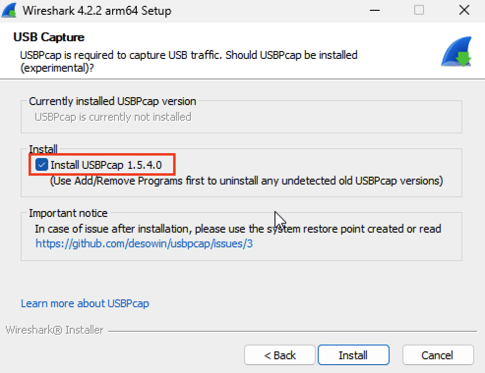
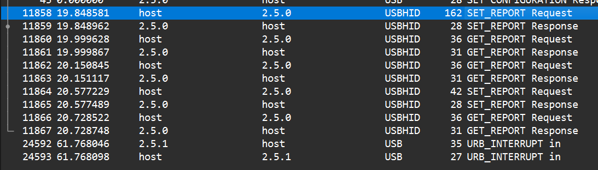

# ROCCAT-IOKIT
At the time of writing this, Roccat didn't have any software for MacOS so  I decided to create something 
from scratch which could enable me to change some settings of the mouse when I don't have a PC around. The
functionality of this repo is pretty basic, but it is aimed to help getting started with writing drivers for
unspecified usb devices from scratch.

## Table of contents

- [Usage](#usege)
- [Reverse-engineering usb protocols](#reverse-engineering-usb-protocols)
    - [Setting up the packet capture environmet](#setting-up-the-packet-capture-environment)
    - [Capturing USB packets with Wireshark](#capturing-usb-packets-with-wireshark)
    - [Understanding the captured data](#understanding-the-captured-data)

## Usage

1. Clone this repo:
```zsh
git clone https://github.com/nooway077/roccat-iokit.git
```
2. Open a Terminal and change the working directory to the folder you have cloned the repo.

3. To change settings of the mouse you must first ***#define*** the correct header inside the `include/device.h`, the predefined one is for ***Roccat Kone AIMO Remastered***. If you have this same device then this tool will work without
any changes.

4. Run `make` from the terminal to build the executable then change working directory to the automatically created **build** folder.

The tool can be called from terminal by this syntax: 
```
./roccat-iokit --[command name] [values]
```
For example the following command will change the color of all leds on the mice to **red**:
```
./roccat-iokit --set_brightness_and_color 100 100 255 0 0
``` 
where the ***first value*** is the ***brightness (from 0 to 100 percentage)*** of all leds, the ***second value*** is the ***intensity of the color (from 0 to 100 percentage)*** and the remaining values are the ***rgb color codes*** in this order: 
***red green blue*** (each from 0 to 255).

## Reverse-engineering USB protocols
There are very good guides out there like [this one](https://github.com/openrazer/openrazer/wiki/Reverse-Engineering-USB-Protocol) which shows how to do this, however I'm going to write it down step by step to make it easier to understand.

### Setting up the packet capture environmet
You will need some sort of software which is able to capture USB packets then extract the data from them. We are going to use
**Wireshark** which is a free cross-platform and open-source packet analyzer used by millions of researchers, engineers, and developers around the world.

1. Download **Wireshark** from the [official download page](https://www.wireshark.org/download.html) for your system.
2. Run the installer and follow the steps. Make sure you tick the **Install USBPcap** checkbox!

    

3. **Reboot the PC**

### Capturing USB packets with Wireshark
If we'd have started the USB capture right now, we would have insane amount of incoming and outgoing packets from all the devices connected to the computer. This means we are going to need to apply some filters such as a specific vendor and a specific product id. Luckily the USB standard assures that each device has to have these programmed in to comply with the standard. The official list of **USB Device Vendor Ids** is available [here](https://usb.org/sites/default/files/vendor_ids051920_0.pdf). Since this guide is focusing on **Roccat** devices, the **vendor id** from the pdf is going to be **7805**.

In order to apply this as filter, we first need to convert this into hexadecimal format, because in Wireshark you will need to use hexadecimal numbers when setting filters. You could use [this](https://www.rapidtables.com/convert/number/decimal-to-hex.html) website to easily do the conversion. After conversion, the **vendor id** is going to be **0x1e7d**. Lets open up **Wireshark** and start capturing USB packets:

1. Highlight all **USBPcap** interfaces on the startup screen, then right click on one of them and click **Start capture**.

    

2. Write `usb.idVendor == 0x1e7d` to the address bar above the packet box to filter out all packets except the ones that are to and from a Roccat device.

    


3. Now you should see all devices with **vendor id** of **0x1e7d**. Click on one of them and examine the **DEVICE_DESCRIPTOR**, you should see the **product id**.

    

4. Apply **product id** as part of the filter: `usb.idVendor == Oxle7d && usb.idProduct = = 0x2e2c`

    

5. Now only that specific device is shown inside Wireshark (in the example, the **Kone Aimo Remastered**).

6. Search for the **USB_URB** line and expand it by clicking on it. Then find the **Device_Address** line and right click on it, and apply it as filter.

    

Wireshark is now focusing on the packets going to and from that specific device.

### Understanding the captured data
It is very important to distinguish between different types of protocols. What we are after in this guide are the packets that
use the **USBHID** protocol, specifically the ones that have **request type** of **SET_REPORT**. If we want to capture these type of packets, we will need to use the official software of the device to send packets and then capture them using Wireshark.
Since this guide is focused on **Roccat devices**, we are going to use the **Roccat Swarm** software for configuring the examined device.

For simplicity, lets set the **brightness of all leds** on the mouse to **0** then to **100 percent** while the Wireshark capture is running.


In Wireshark, we can see the communication between the driver and the device: 



We are intrested in the packet with **SET_REPORT** label which is sent from **host** to **2.5.0** (the usb device's address). If we examine the **Setup Data** of this packet, we can identify the we have a request `SET_REPORT` with a type of `0x21`, value of `0x0306`, an index of 0 and a length of 126 bytes. We also have the `Data Fragment` which carries the information **the driver sent to the device**. We are going to refer to this as **payload**. (in older versions of Wireshark, this was called **Leftover Capture Data**) 


On the right side panel, we can see the bytes that are inside the captured frame. It consists of the **USB_URB** and the **Setup Data**. We need to focus on the **Setup Data** and the **Data Fragment** which contains the information that is sent to the device.

If we set the brighness back to **100 percent**, we can examine that the **SET_REPORT Request** will look like the first one, only some values in the **Data Fragment** will be different.


To highlight the **payload** bytes, click on the **Data Fragment**.
When comparing the **payload** of the two captured frames side by side, we can notice the different values:


In the **Roccat Swarm** app, the brightness is set by percentage and it is from **0 to 100** which is in decimal. In USB payloads these are mostly **hexadecimal** values which means it will be **from 0 to 255.** Since we set the brightness to **100 percent** in the second payload, that is **0xff** in **hexadecimal**. Now we have successfully identified the **byte** that is controlling the brightness of the leds on the device. The last two bytes of the payload are always different, even when nothing is changed in the app which means they are probably used for **Cyclic Redundancy Check**.

Now that we know which byte changes the brightness, we could create a structure to define the payload and then change that
byte to something else and send that to the device to see if it works. You will find a preconfigured header file in the `include/device` directory for the **Kone AIMO Remastered** mouse which you can use as template when reverse-engineering your own device.


